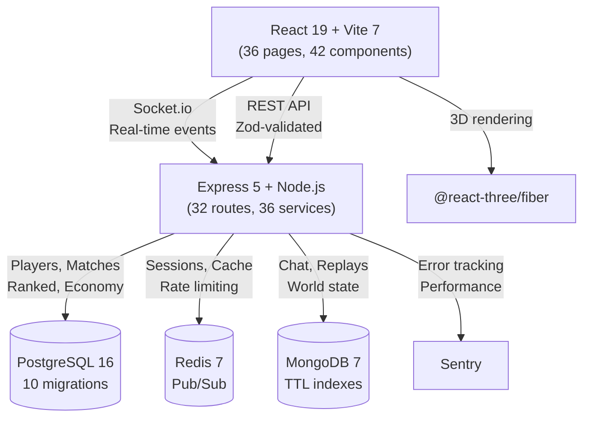

<div align="center">


<br/>


<br/>

[](https://github.com/WimLee115/hacknet-protocol-game)
[](https://www.typescriptlang.org/)
[](https://vitest.dev/)
[](https://react.dev/)
[](https://nodejs.org/)
[](LICENSE)

<br/>

```
 ██╗  ██╗ █████╗  ██████╗██╗  ██╗███╗   ██╗███████╗████████╗
 ██║  ██║██╔══██╗██╔════╝██║ ██╔╝████╗  ██║██╔════╝╚══██╔══╝
 ███████║███████║██║     █████╔╝ ██╔██╗ ██║█████╗     ██║
 ██╔══██║██╔══██║██║     ██╔═██╗ ██║╚██╗██║██╔══╝     ██║
 ██║  ██║██║  ██║╚██████╗██║  ██╗██║ ╚████║███████╗   ██║
 ╚═╝  ╚═╝╚═╝  ╚═╝ ╚═════╝╚═╝  ╚═╝╚═╝  ╚═══╝╚══════╝   ╚═╝
              P R O T O C O L
```


<br/>

**HACKNET PROTOCOL** is a full-stack, browser-based competitive hacking game. Two players compete head-to-head in real-time terminal duels using authentic-feeling commands. Compromise your opponent's server while defending your own — all in a sleek cyberpunk UI.

**Solo-developed over 101 sprints** with 58,800+ lines of TypeScript across 305 source files.

</div>


## What Makes It Different

| Feature | HACKNET PROTOCOL |
|:--------|:----------------|
| **Real-time PvP** | Socket.io-powered 1v1 duels with sub-second latency |
| **Authentic Commands** | `nmap`, `sqlmap`, `hydra`, `msfconsole` — not toy commands |
| **Terminal 2.0** | Command palette, autocomplete, syntax highlighting, output search |
| **5 Hacker Classes** | Each with unique abilities and 75-node skill trees |
| **ELO Ranking** | Competitive matchmaking from Bronze to Diamond |
| **AI Opponents** | 5-personality bot AI with tactical decision engine |
| **Full Economy** | Player marketplace, season pass, achievement system |
| **Zero Dependencies Audio** | Web Audio API synthesized sounds — no files needed |


## Game Overview

### The Terminal

The core experience. Type real hacking commands in a professional terminal interface:

- **Ctrl+K** — Command palette with fuzzy search across all 35 commands
- **Tab** — Smart autocomplete with category-coded dropdown
- **Syntax highlighting** — Commands colored by type (recon, exploit, defense, etc.)
- **Ctrl+F** — Search through terminal output
- **Ctrl+R** — Reverse history search

### 5 Hacker Classes

Choose your specialization. Each class plays differently:

| Class | Icon | Playstyle | Unique Abilities |
|:------|:----:|:----------|:----------------|
| **Network Specialist** | Signal | Methodical recon | Deep Scan, Packet Capture |
| **Social Engineer** | Masks | Stealth & deception | Phish Attack, Distraction |
| **Malware Developer** | Flask | Aggressive exploits | Craft Exploit, Deploy Rootkit |
| **Cryptographer** | Key | Technical cracking | Decrypt Intercept, Hash Crack |
| **Systems Architect** | Shield | Defensive counter | Fortify, Deploy Honeypot |

### Match Flow

```
MATCHMAKING ──> COUNTDOWN ──> DUEL (5 min) ──> RESULTS
                                │
                     ┌──────────┼──────────┐
                     │          │          │
                   RECON     EXPLOIT    DEFEND
                   nmap      sqlmap     firewall
                   nikto     hydra      patch
                   whois     ssh_brute  monitor
                     │          │          │
                     └──────────┼──────────┘
                                │
                     WIN: Root access OR
                          Integrity drain
```

### 3 Factions

Global faction competition with unique identities:

- **White Hat** — Ethical hackers. Defend the net.
- **Black Hat** — No rules. Maximum damage.
- **Hacktivist** — Hack for a cause.


## Feature Breakdown

### Competitive Systems
- **Ranked Mode** — Placement matches, tier promotion/demotion, seasonal resets
- **Weekly Tournaments** — Single-elimination brackets with ELO seeding
- **Match Replays** — Full playback at 0.5x-4x speed with match statistics (APM, command categories, key events)
- **Spectator Mode** — Watch live matches with viewer count
- **Alliance Wars** — Territory-based guild competition on a 10x10 grid

### Progression Systems
- **Season Pass** — 30 tiers with free + premium tracks
- **Skill Trees** — 75 nodes across 3 branches per class, 5 tiers deep
- **26 Achievements** — Common through Legendary rarity
- **Daily/Weekly Challenges** — Rotating objectives for XP and credits
- **Prestige System** — Account-wide bonuses after max level

### Social Systems
- **Real-time Chat** — Global, faction, and DM channels with MongoDB persistence
- **Notification Center** — 5 categories, inline accept/decline buttons, toast pop-ups
- **16 Emotes** — Keyboard shortcuts (1-0), spectator-visible, with cooldown system
- **Friends** — Online status, match invites, search

### Economy
- **Item Shop** — 50+ cosmetics purchasable with earned credits
- **Exploit Marketplace** — Player-to-player trading with bidding and buyout
- **Premium Shop** — Dark Coins for exclusive items

### Server Building
- **Hardware** — CPU, RAM, Storage upgrades (5 levels each)
- **Services** — SSH, HTTP, FTP, MySQL, and 8 more configurable services
- **Firewalls** — Custom rule builder (up to 20 rules)
- **Honeypots** — 3 types of decoy systems to mislead attackers


## Technical Highlights

### Architecture



### Quality Metrics

| Metric | Details |
|:-------|:--------|
| **Test Coverage** | 975 automated tests (847 server + 128 client) |
| **Type Safety** | Strict TypeScript, 0 errors across entire codebase |
| **Validation** | Zod schemas on all 32 API route files |
| **Security** | Anti-cheat, input sanitization, per-user rate limiting, JWT blacklisting |
| **CI/CD** | GitHub Actions: lint, typecheck, test, build |
| **Monitoring** | Sentry integration (server + client), Winston structured logging |
| **API Docs** | OpenAPI 3.0 specification with Swagger UI |

### Bot AI System

The DuelBot uses a 5-personality tactical decision engine:

| Personality | ELO Range | Style |
|:-----------|:----------|:------|
| Script Kiddie | < 900 | Random, slow, makes mistakes |
| Cautious | 900-1100 | Safe, methodical scanning |
| Balanced | 1100-1400 | Mix of offense and defense |
| Aggressive | 1400-1700 | Fast exploits, high risk |
| Elite | 1700+ | Adaptive, counter-attacks, stealth-aware |

The bot tracks match state in real-time and uses a 6-priority decision system:
1. Emergency stealth (detection > 80%)
2. Emergency defense (own integrity < 30%)
3. Counter-hack (opponent detected)
4. Stealth maintenance
5. Time pressure rush (< 60s remaining)
6. Phase-appropriate commands


## Tech Stack

| Layer | Technologies |
|:------|:------------|
| **Frontend** | React 19, TypeScript 5.7, Vite 7, TailwindCSS v4, @react-three/fiber, Socket.io Client |
| **Backend** | Node.js 20, Express 5, Socket.io 4.8, JWT + bcrypt, Zod v4, Winston |
| **Databases** | PostgreSQL 16, Redis 7, MongoDB 7 |
| **Testing** | Vitest, Supertest, React Testing Library |
| **DevOps** | Docker Compose, GitHub Actions, Sentry, Multi-stage Dockerfile |
| **Audio** | Web Audio API (oscillators + noise buffers, zero external files) |


## Development Journey

Built solo over 101 sprints:

```
Sprints  1-20  ██████████████████████████████████████████ Foundation
Sprints 21-40  ██████████████████████████████████████████ Gameplay
Sprints 41-55  ██████████████████████████████████         Economy
Sprints 56-70  ██████████████████████████████████         World
Sprints 71-80  ████████████████████████                   Design System
Sprints 81-90  ████████████████████████                   Hardening
Sprints 91-101 ██████████████████████████████             Polish + Terminal 2.0
```

### Key Milestones
- **Sprint 1** — First terminal + command execution
- **Sprint 20** — Full match engine with 25 commands
- **Sprint 50** — Season pass + marketplace
- **Sprint 70** — NPC world + story missions
- **Sprint 80** — 3D design system overhaul
- **Sprint 90** — 952 tests, CI/CD, Docker, legal
- **Sprint 100** — Enhanced replay system
- **Sprint 101** — Terminal 2.0 + Class Selection


## Source Code

The full source code is in the private repository [hacknet-protocol](https://github.com/WimLee115/hacknet-protocol). Contact me for access.

---

## License

[MIT](LICENSE)

## Author

**WimLee115** — [github.com/WimLee115](https://github.com/WimLee115)

---

<div align="center">

*Solo-built with 58,800+ lines of TypeScript, 975 tests, and 101 sprints of obsession.*

**HACKNET PROTOCOL** -- Access Granted. Game On.

<br/>


</div>
